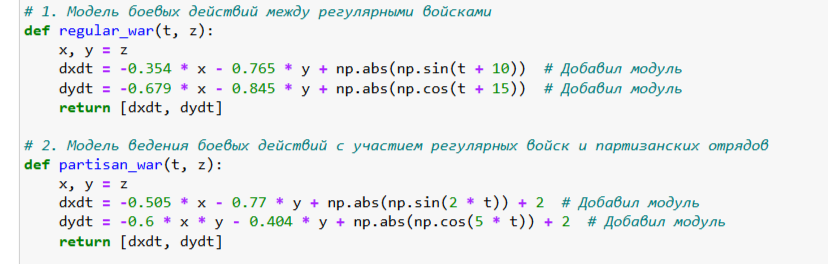
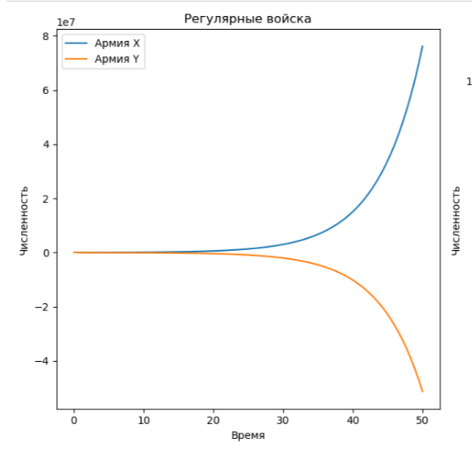

---
## Front matter
lang: ru-RU
title: Лабораторная Работа №3
subtitle: Модель боевых действий
author:
  - Ощепков Дмитрий Владимирович
institute:
  - Российский университет дружбы народов им. Патриса Лумумбы, Москва, Россия

## i18n babel
babel-lang: russian
babel-otherlangs: english

## Formatting pdf
toc: false
toc-title: Содержание
slide_level: 2
aspectratio: 169
section-titles: true
theme: metropolis
header-includes:
 - \metroset{progressbar=frametitle,sectionpage=progressbar,numbering=fraction}
 - '\makeatletter'
 - '\makeatother'

## Fonts
mainfont: Arial
romanfont: Arial
sansfont: Arial
monofont: Arial
---

## Докладчик

  * Ощепков Дмитрий Владимирович 
  * НФИбд-01-22
  * Российский университет дружбы народов
  * [1132226442@pfur.ru]
  
# Выполнение лабораторной работы

## Цель работы

Построить математическую модель боевых действий

## Задание

Вариант 54 (1132226442%70+1)
Между страной Х и страной У идет война. Численность состава войск
исчисляется от начала войны, и являются временными функциями
xt и yt.
В начальный момент времени страна Х имеет армию численностью 87 700 человек, а
в распоряжении страны У армия численностью в 91 400 человек. Для упрощения
модели считаем, что коэффициенты a b c h постоянны. Также считаем Pt и Qt
непрерывные функции.
Постройте графики изменения численности войск армии Х и армии У для
следующих случаев:

# Выполнение лабораторной работы

Уравнения, описывающие преимущества и недостатки армий в зависимости от коэффициентов. Решаем систему рисуем потом через plot графики
условиями для двух случаев (рис. [-@fig:001])

{ #fig:001 width=70% }

## Модель боевых действий между регулярными войсками (рис. [-@fig:002])

{ #fig:002 width=70% }

## Модель ведение боевых действий с участием регулярных войск ипартизанских отрядов (рис. [-@fig:003])

{ #fig:003 width=70% }

## Комментарии

Первые график расходится, потому что у синих большие подкрепления, на втором быстро снижаются оранжевые, потому что в убывании учитывается произведение нескольких переменных, то есть одна армия по умолчанию в позиции хуже.

# Выводы

Построил математические модели боевых действий