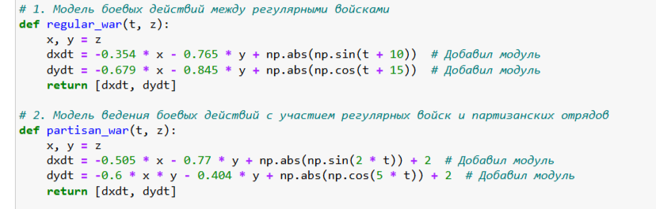
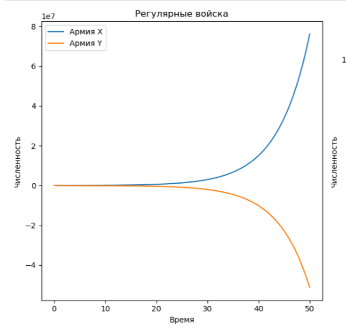

---
## Front matter
title: "Отчёт по лабораторной работе №3"
subtitle: "Модель боевых действий"
author: "Ощепков Дмитрий Владимирович НФИбд-01-22"

## Generic otions
lang: ru-RU
toc-title: "Содержание"

## Bibliography
bibliography: bib/cite.bib
csl: pandoc/csl/gost-r-7-0-5-2008-numeric.csl

## Pdf output format
toc: true # Table of contents
toc-depth: 2
lof: true # List of figures
lot: true # List of tables
fontsize: 12pt
linestretch: 1.5
papersize: a4
documentclass: scrreprt
## I18n polyglossia
polyglossia-lang:
  name: russian
polyglossia-otherlangs:
  name: english
## I18n babel
babel-lang: russian
babel-otherlangs: english
## Fonts
mainfont: Arial
romanfont: Arial
sansfont: Arial
monofont: Arial
mainfontoptions: Ligatures=TeX
romanfontoptions: Ligatures=TeX
sansfontoptions: Ligatures=TeX,Scale=MatchLowercase
monofontoptions: Scale=MatchLowercase,Scale=0.9
## Biblatex
biblatex: true
biblio-style: "gost-numeric"
biblatexoptions:
  - parentracker=true
  - backend=biber
  - hyperref=auto
  - language=auto
  - autolang=other*
  - citestyle=gost-numeric
## Pandoc-crossref LaTeX customization
figureTitle: "Рис."
tableTitle: "Таблица"
listingTitle: "Листинг"
lofTitle: "Список иллюстраций"
lotTitle: "Список таблиц"
lolTitle: "Листинги"
## Misc options
indent: true
header-includes:
  - \usepackage{indentfirst}
  - \usepackage{float} # keep figures where there are in the text
  - \floatplacement{figure}{H} # keep figures where there are in the text
---

# Цель работы

Построить математическую модель боевых действий

# Задание

Вариант 54 (1132226442%70+1)
Между страной Х и страной У идет война. Численность состава войск
исчисляется от начала войны, и являются временными функциями
xt и yt.
В начальный момент времени страна Х имеет армию численностью 87 700 человек, а
в распоряжении страны У армия численностью в 91 400 человек. Для упрощения
модели считаем, что коэффициенты a b c h постоянны. Также считаем Pt и Qt
непрерывные функции.
Постройте графики изменения численности войск армии Х и армии У для
следующих случаев:

# Выполнение лабораторной работы

Уравнения, описывающие преимущества и недостатки армий в зависимости от коэффициентов. Решаем систему рисуем потом через plot графики
условиями для двух случаев (рис. [-@fig:001])

{ #fig:001 width=70% }

Модель боевых действий между регулярными войсками (рис. [-@fig:002])

{ #fig:002 width=70% }

Модель ведение боевых действий с участием регулярных войск ипартизанских отрядов (рис. [-@fig:003])

{ #fig:003 width=70% }

Комментарии:

Первые график расходится, потому что у синих большие подкрепления, на втором быстро снижаются оранжевые, потому что в убывании учитывается произведение нескольких переменных, то есть одна армия по умолчанию в позиции хуже.

# Выводы

Построил математические модели боевых действий
