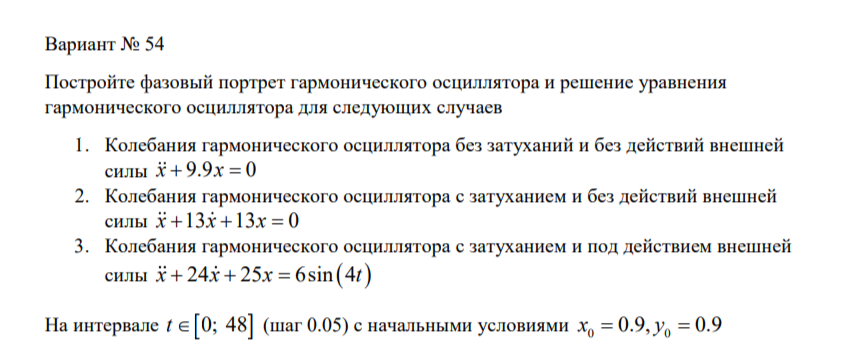
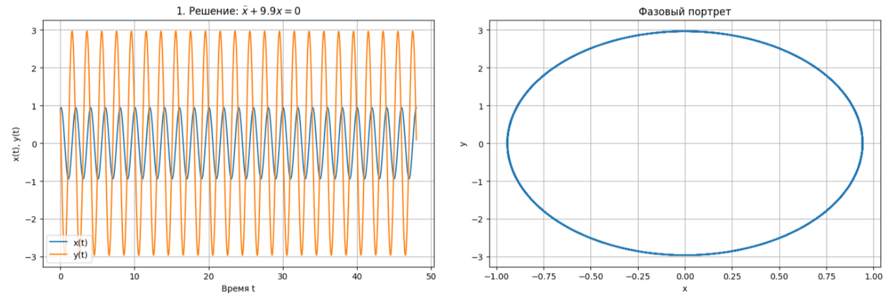
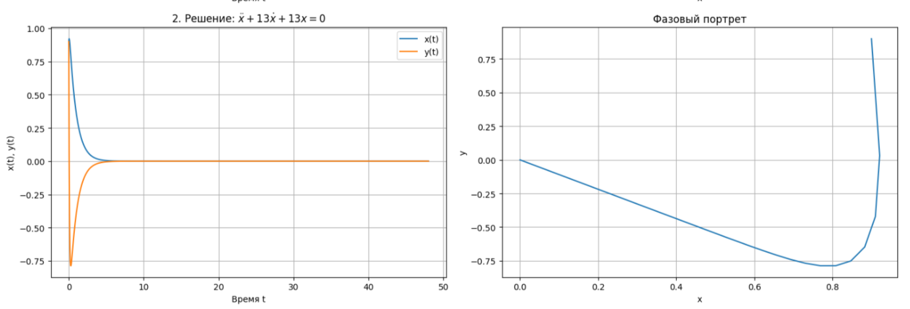
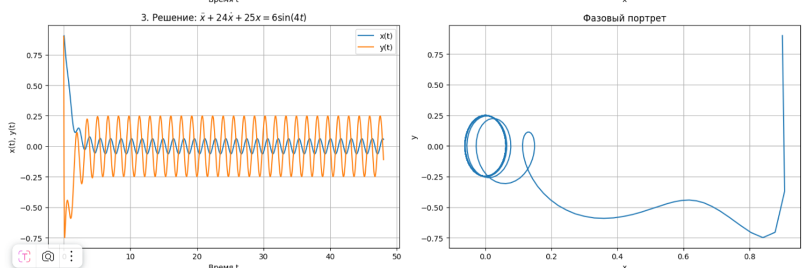

---
## Front matter
lang: ru-RU
title: Лабораторная Работа №4
subtitle: Модель гармонических колебаний
author:
  - Ощепков Дмитрий Владимирович
institute:
  - Российский университет дружбы народов им. Патриса Лумумбы, Москва, Россия

## i18n babel
babel-lang: russian
babel-otherlangs: english

## Formatting pdf
toc: false
toc-title: Содержание
slide_level: 2
aspectratio: 169
section-titles: true
theme: metropolis
header-includes:
 - \metroset{progressbar=frametitle,sectionpage=progressbar,numbering=fraction}
 - '\makeatletter'
 - '\makeatother'

## Fonts
mainfont: Arial
romanfont: Arial
sansfont: Arial
monofont: Arial
---

## Докладчик

  * Ощепков Дмитрий Владимирович 
  * НФИбд-01-22
  * Российский университет дружбы народов
  * [1132226442@pfur.ru]
  
## Цель работы

Построить математическую модель гармонических колебаний

## Задание

{ #fig:001 width=70% }

## Первое уравнение: его рещение и фазовый портрет 

{ #fig:002 width=70% }

## Второе уравнение: его рещение и фазовый портрет  (рис. [-@fig:002])

{ #fig:003 width=70% }

## Третье уравнение: его рещение и фазовый портрет   (рис. [-@fig:003])

{ #fig:004 width=70% }

## Выводы

Построил математическую модель гармонических колебаний
