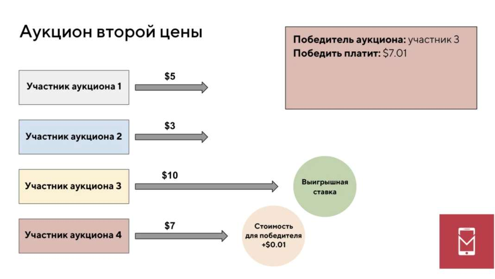

---
## Front matter
title: "Отчёт по лабораторной работе №5"
subtitle: "Диффуры"
author: "Ощепков Дмитрий Владимирович НФИбд-01-22"

## Generic otions
lang: ru-RU
toc-title: "Содержание"

## Bibliography
bibliography: bib/cite.bib
csl: pandoc/csl/gost-r-7-0-5-2008-numeric.csl

## Pdf output format
toc: true # Table of contents
toc-depth: 2
lof: true # List of figures
lot: true # List of tables
fontsize: 12pt
linestretch: 1.5
papersize: a4
documentclass: scrreprt
## I18n polyglossia
polyglossia-lang:
  name: russian
polyglossia-otherlangs:
  name: english
## I18n babel
babel-lang: russian
babel-otherlangs: english
## Fonts
mainfont: Arial
romanfont: Arial
sansfont: Arial
monofont: Arial
mainfontoptions: Ligatures=TeX
romanfontoptions: Ligatures=TeX
sansfontoptions: Ligatures=TeX,Scale=MatchLowercase
monofontoptions: Scale=MatchLowercase,Scale=0.9
## Biblatex
biblatex: true
biblio-style: "gost-numeric"
biblatexoptions:
  - parentracker=true
  - backend=biber
  - hyperref=auto
  - language=auto
  - autolang=other*
  - citestyle=gost-numeric
## Pandoc-crossref LaTeX customization
figureTitle: "Рис."
tableTitle: "Таблица"
listingTitle: "Листинг"
lofTitle: "Список иллюстраций"
lotTitle: "Список таблиц"
lolTitle: "Листинги"
## Misc options
indent: true
header-includes:
  - \usepackage{indentfirst}
  - \usepackage{float} # keep figures where there are in the text
  - \floatplacement{figure}{H} # keep figures where there are in the text
---

# Аукцион второй цены (Викри)  

---

### 🎮 Пример: Покупаем PlayStation  
**Участники:**  
- Ты: 50 000₽  
- Друг: 45 000₽  
- Незнакомец: 60 000₽  

**Как работает:**  
1. Все пишут свою **максимальную цену** (тайно).  
2. Победитель — тот, кто дал **самую высокую цену** (Незнакомец).  
3. **Платит он не свои 60 000₽, а вторую цену** — твои 50 000₽.  

**Итог:**  
- Незнакомец рад: хотел 60к → платит 50к.  
- Ты не переплачиваешь.  
- Продавец доволен: цена честная.  

---

### ❓ Зачем это нужно?  
1. **Не надо врать** — выгодно писать реальную цену.  
2. **Нельзя проиграть** из-за хитрости других.  
3. **Работает автоматически** (как светофор).  

## Схема

  
*Как на картинке: победитель платит на 1 шаг меньше.*

---

### 🌍 Где это используют?  
1. **Google/Yandex** — реклама в поиске.  
2. **Госзакупки** — выбор поставщика без взяток.  
3. **NFT** — продажа цифрового искусства.  

**Секрет успеха:**  
- В Google каждый клик — мини-аукцион.  
- За 1 день таких аукционов больше, чем людей на Земле.  

---

### ⚡️ Плюсы vs Минусы  
| ✅ Хорошо | ❌ Плохо |  
|----------|----------|  
| Честно для всех | Люди путаются |  
| Продавец получает рыночную цену | Можно сжульничать (если все сговорятся) |  
| Не надо торговаться | Сложно объяснить бабушке |  

---

### 💡 Главная идея  
**Аукцион Викри — как умный робот:**  
- Сам находит справедливую цену.  
- Не дает переплатить.  
- Работает без криков и споров.  

**Почему это революция?**  
- Нобелевская премия (1996).  
- Используется в 90% интернет-рекламы.  
- Экономит миллиарды ₽.  

---

### 🎓 Что запомнить?  
1. **Платишь не свою цену** — всегда выгодно быть честным.  
2. **Работает везде** — от Google до продажи картин.  
3. **Просто и гениально** — как колесо для экономики.  

**Финал:** Если бы так продавали билеты на концерт — спекулянты бы умерли с голоду! 😎  
